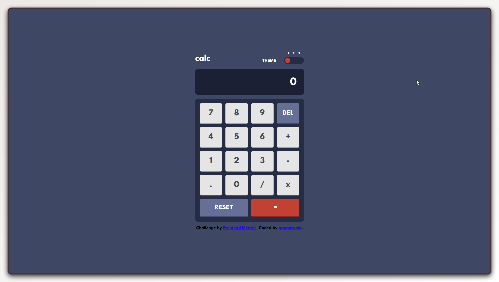

# Frontend Mentor - Calculator app solution

This is a solution to the [Calculator app challenge on Frontend Mentor](https://www.frontendmentor.io/challenges/calculator-app-9lteq5N29). Frontend Mentor challenges help you improve your coding skills by building realistic projects.

## Table of contents

- [Overview](#overview)
  - [The challenge](#the-challenge)
  - [Screenshot](#screenshot)
  - [Links](#links)
- [My process](#my-process)
  - [Built with](#built-with)
  - [What I learned](#what-i-learned)
  - [Continued development](#continued-development)
  - [Useful resources](#useful-resources)
- [Author](#author)
- [Acknowledgments](#acknowledgments)

## Overview

### The challenge

Users should be able to:

- See the size of the elements adjust based on their device's screen size
- Perform mathematical operations like addition, subtraction, multiplication, and division
- Adjust the color theme (1, 2, or 3) using the slider in the header

### Screenshot

### Links

- Solution URL: [Add solution URL here](https://your-solution-url.com)
- Live Site URL: [Add live site URL here](https://your-live-site-url.com)

## My process

### Built with

- Semantic HTML5 markup
- CSS custom properties
- Flexbox
- CSS Grid
- Vanilla JavaScript

### What I learned

Using CSS custom properties to drive all three themes. Each theme is scoped to a `[data-theme]` attribute on the `<html>` element, so switching themes is just one `setAttribute` call, no class toggling or style injection needed.

Managing calculator state with a small set of plain variables (`numero1`, `numero2`, `currentOperator`, `firstStep`, `consecutiveEqual`) turned out to be enough for all the edge cases, including chaining operations after pressing `=`.

A native `<input type="range">` handles the theme picker, which keeps the interaction accessible without any custom JavaScript for the control itself.

### Continued development

- Detect `prefers-color-scheme` on first load and persist the user's choice in `localStorage` (the bonus requirement from the challenge).
- Add full keyboard support so the calculator can be operated without a mouse.
- Improve number input handling: prevent multiple decimal points, handle very large results gracefully.

### Useful resources

- [MDN — CSS custom properties](https://developer.mozilla.org/en-US/docs/Web/CSS/--*) - Authoritative reference for custom property inheritance and the `var()` function.
- [MDN — input type="range"](https://developer.mozilla.org/en-US/docs/Web/HTML/Element/input/range) - Covers styling the thumb and track cross-browser.

## Author

- GitHub - [@ggandream](https://github.com/ggandream)
- Frontend Mentor - [@ggandream](https://www.frontendmentor.io/profile/ggandream)

## Acknowledgments

Challenge by [Frontend Mentor](https://www.frontendmentor.io). Thanks to [@Renato6GS](https://github.com/Renato6GS) for the guidance throughout this project.
